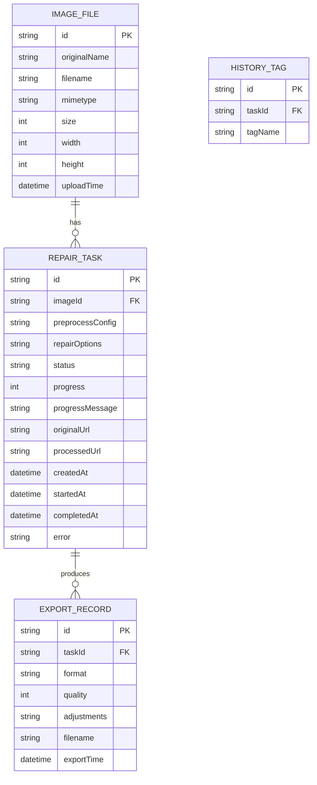

## 1. 架构设计

```mermaid
graph TB
    subgraph "前端层 (React + Vite)"
        A["工作台页面"]
        B["历史记录页面"]
        C["图片预览页面"]
        D["组件库"]
        E["状态管理 (Zustand)"]
        F["WebSocket客户端"]
    end

    subgraph "后端服务层 (Express + Node.js)"
        G["API网关 (8682端口)"]
        H["文件上传服务"]
        I["图片处理服务"]
        J["异步任务队列 (Bull)"]
        K["AI修复模拟引擎"]
        L["WebSocket服务"]
        M["历史记录管理"]
    end

    subgraph "数据存储层"
        N["SQLite数据库"]
        O["文件系统存储"]
    end

    subgraph "外部服务"
        P["AI修复服务接口"]
    end

    A --> G
    B --> G
    C --> G
    D --> A
    D --> B
    D --> C
    E --> A
    E --> B
    E --> C
    F --> L

    G --> H
    G --> I
    G --> M
    H --> O
    I --> J
    J --> K
    K --> P
    K --> O
    L --> F
    M --> N

    O -->|uploads/| 原始图片
    O -->|cache/| 临时缓存
    O -->|processed/| 修复结果
    O -->|exports/| 导出文件

    style A fill:#3D5A54,stroke:#C9A962
    style B fill:#3D5A54,stroke:#C9A962
    style C fill:#3D5A54,stroke:#C9A962
    style G fill:#2D1B0E,stroke:#C9A962
    style K fill:#2D1B0E,stroke:#C9A962
    style J fill:#C9A962,stroke:#2D1B0E,color:#2D1B0E
```



## 2. 技术描述

### 2.1 技术栈选型

| 层级 | 技术选型 | 版本 | 用途 |
|------|----------|------|------|
| 前端框架 | React | ^18.2.0 | UI框架 |
| 前端语言 | TypeScript | ^5.3.0 | 类型安全 |
| 构建工具 | Vite | ^5.0.0 | 开发构建 |
| 状态管理 | Zustand | ^4.4.0 | 全局状态 |
| 路由管理 | React Router DOM | ^6.20.0 | 页面路由 |
| UI样式 | TailwindCSS | ^3.3.0 | 原子化样式 |
| 图标库 | Lucide React | ^0.294.0 | 图标组件 |
| 图片编辑 | react-image-crop | ^10.1.0 | 图片裁剪 |
| Canvas绘制 | 原生Canvas API | - | 污点修补、旋转 |
| 图片对比 | react-compare-slider | ^3.0.0 | 修复前后对比 |
| 后端框架 | Express | ^4.18.0 | API服务 |
| 后端语言 | TypeScript | ^5.3.0 | 类型安全 |
| 文件上传 | multer | ^1.4.5 | 处理文件上传 |
| 任务队列 | Bull | ^4.12.0 | 异步任务队列 |
| Redis | ioredis | ^5.3.0 | 队列存储 |
| WebSocket | ws | ^8.14.0 | 实时通信 |
| 数据库 | better-sqlite3 | ^9.2.0 | 轻量数据存储 |
| 图片处理 | sharp | ^0.33.0 | 图片格式转换 |
| HTTP客户端 | axios | ^1.6.0 | API请求 |

### 2.2 项目初始化

- **初始化工具**: vite-init
- **模板**: react-express-ts (React + Express + TypeScript 全栈模板)
- **包管理器**: npm
- **前端运行端口**: 5173 (Vite开发服务器)
- **后端API端口**: 8682 (Express服务)

### 2.3 文件目录结构

```
lj0017/
├── src/                          # 前端源码
│   ├── components/               # 公共组件
│   │   ├── layout/              # 布局组件
│   │   ├── upload/              # 上传组件
│   │   ├── editor/              # 图片编辑组件
│   │   ├── task/                # 任务队列组件
│   │   └── common/              # 通用组件
│   ├── pages/                   # 页面组件
│   │   ├── Workbench.tsx        # 工作台
│   │   ├── History.tsx          # 历史记录
│   │   └── Preview.tsx          # 图片预览
│   ├── hooks/                   # 自定义Hooks
│   │   ├── useImageEditor.ts    # 图片编辑Hook
│   │   ├── useTaskQueue.ts      # 任务队列Hook
│   │   └── useWebSocket.ts      # WebSocket Hook
│   ├── store/                   # 状态管理
│   │   ├── useImageStore.ts     # 图片状态
│   │   └── useTaskStore.ts      # 任务状态
│   ├── utils/                   # 工具函数
│   │   ├── imageProcessor.ts    # 图片处理
│   │   └── format.ts            # 格式化工具
│   ├── types/                   # TypeScript类型
│   │   └── index.ts             # 类型定义
│   ├── App.tsx                  # 应用入口
│   └── main.tsx                 # React入口
├── api/                          # 后端源码
│   ├── src/
│   │   ├── controllers/         # 控制器
│   │   │   ├── uploadController.ts
│   │   │   ├── taskController.ts
│   │   │   └── historyController.ts
│   │   ├── services/            # 业务服务
│   │   │   ├── fileService.ts
│   │   │   ├── taskService.ts
│   │   │   ├── imageService.ts
│   │   │   └── aiService.ts
│   │   ├── queue/               # 任务队列
│   │   │   ├── worker.ts
│   │   │   └── processor.ts
│   │   ├── websocket/           # WebSocket
│   │   │   └── server.ts
│   │   ├── database/            # 数据库
│   │   │   ├── index.ts
│   │   │   └── schema.sql
│   │   ├── middleware/          # 中间件
│   │   ├── routes/              # 路由
│   │   ├── types/               # 类型定义
│   │   └── server.ts            # 服务入口
│   └── storage/                 # 文件存储
│       ├── uploads/             # 上传原图
│       ├── cache/               # 临时缓存
│       ├── processed/           # 修复结果
│       └── exports/             # 导出文件
├── shared/                       # 前后端共享类型
│   └── types.ts
├── vite.config.ts                # Vite配置
├── tailwind.config.js            # Tailwind配置
├── tsconfig.json                 # TypeScript配置
└── package.json                  # 项目依赖
```

## 3. 路由定义

### 3.1 前端路由

| 路由路径 | 页面组件 | 说明 |
|----------|----------|------|
| `/` | Workbench | 工作台 - 默认首页 |
| `/workbench` | Workbench | 工作台 |
| `/history` | History | 历史记录 |
| `/preview/:taskId` | Preview | 图片预览与后处理 |

### 3.2 API路由

| 方法 | 路由 | 说明 |
|------|------|------|
| POST | `/api/upload` | 批量上传图片 |
| GET | `/api/upload/:filename` | 获取上传图片 |
| POST | `/api/tasks` | 创建修复任务 |
| GET | `/api/tasks` | 获取任务列表 |
| GET | `/api/tasks/:id` | 获取单个任务详情 |
| PUT | `/api/tasks/:id/pause` | 暂停任务 |
| PUT | `/api/tasks/:id/resume` | 恢复任务 |
| PUT | `/api/tasks/:id/retry` | 重试任务 |
| GET | `/api/processed/:filename` | 获取处理后图片 |
| POST | `/api/export/:taskId` | 导出指定格式图片 |
| GET | `/api/history` | 获取历史记录列表 |
| DELETE | `/api/history/:id` | 删除历史记录 |
| GET | `/api/health` | 健康检查 |

## 4. API 类型定义

```typescript
// 共享类型定义
export interface ImageFile {
  id: string;
  originalName: string;
  filename: string;
  mimetype: string;
  size: number;
  uploadTime: number;
  width?: number;
  height?: number;
}

export interface PreprocessConfig {
  rotation: number;
  crop?: {
    x: number;
    y: number;
    width: number;
    height: number;
  };
  spotRemoval?: Array<{ x: number; y: number; radius: number }>;
}

export type RepairMode = 'scratch' | 'damage' | 'enhance' | 'colorize' | 'comprehensive';

export interface RepairOptions {
  modes: RepairMode[];
  preserveStyle: boolean;
  upscaleFactor: 1 | 2 | 4;
  colorizationStyle?: 'natural' | 'vintage' | 'vivid';
}

export type TaskStatus = 'pending' | 'queued' | 'processing' | 'paused' | 'completed' | 'failed';

export interface RepairTask {
  id: string;
  imageId: string;
  image: ImageFile;
  preprocess: PreprocessConfig;
  options: RepairOptions;
  status: TaskStatus;
  progress: number;
  progressMessage: string;
  originalUrl: string;
  processedUrl?: string;
  createdAt: number;
  startedAt?: number;
  completedAt?: number;
  error?: string;
}

export interface Adjustments {
  brightness: number;
  contrast: number;
  sharpness: number;
  saturation?: number;
}

export type ExportFormat = 'jpg' | 'png' | 'webp' | 'tiff';

export interface ExportOptions {
  format: ExportFormat;
  quality: number;
  adjustments: Adjustments;
}

// 请求/响应类型
export interface UploadResponse {
  success: boolean;
  data: ImageFile[];
}

export interface CreateTaskRequest {
  imageId: string;
  preprocess: PreprocessConfig;
  options: RepairOptions;
}

export interface CreateTaskResponse {
  success: boolean;
  data: RepairTask;
}

export interface TaskListResponse {
  success: boolean;
  data: {
    list: RepairTask[];
    total: number;
  };
}

export interface ProgressUpdate {
  taskId: string;
  status: TaskStatus;
  progress: number;
  message: string;
}
```

## 5. 服务器架构图

```mermaid
graph TD
    subgraph "Express Server (8682)"
        A["HTTP Server"]
        B["WebSocket Server (ws)"]
        C["Router Layer"]
        D["Middleware Layer"]
    end

    subgraph "Controller Layer"
        E["UploadController"]
        F["TaskController"]
        G["HistoryController"]
    end

    subgraph "Service Layer"
        H["FileService"]
        I["TaskService"]
        J["ImageService"]
        K["AIService"]
    end

    subgraph "Queue Layer"
        L["Bull Queue"]
        M["Worker Process"]
        N["Task Processor"]
    end

    subgraph "Data Layer"
        O["SQLite Database"]
        P["File System Storage"]
        Q["Redis (Queue)"]
    end

    A --> C
    C --> D
    D --> E
    D --> F
    D --> G

    E --> H
    F --> I
    G --> I

    I --> J
    I --> K
    I --> L

    H --> P
    J --> P
    K --> P

    L --> Q
    L --> M
    M --> N
    N --> K
    N --> I

    I --> O
    I --> B
    B -->|实时推送| F

    style A fill:#2D1B0E,stroke:#C9A962
    style B fill:#2D1B0E,stroke:#C9A962
    style L fill:#C9A962,stroke:#2D1B0E,color:#2D1B0E
    style K fill:#3D5A54,stroke:#C9A962
```



## 6. 数据模型

### 6.1 数据模型定义



### 6.2 数据库Schema (SQLite)

```sql
-- 图片文件表
CREATE TABLE IF NOT EXISTS image_files (
    id TEXT PRIMARY KEY,
    original_name TEXT NOT NULL,
    filename TEXT NOT NULL UNIQUE,
    mimetype TEXT NOT NULL,
    size INTEGER NOT NULL,
    width INTEGER,
    height INTEGER,
    upload_time INTEGER NOT NULL
);

-- 修复任务表
CREATE TABLE IF NOT EXISTS repair_tasks (
    id TEXT PRIMARY KEY,
    image_id TEXT NOT NULL,
    preprocess_config TEXT NOT NULL,
    repair_options TEXT NOT NULL,
    status TEXT NOT NULL DEFAULT 'pending',
    progress INTEGER NOT NULL DEFAULT 0,
    progress_message TEXT,
    original_url TEXT NOT NULL,
    processed_url TEXT,
    created_at INTEGER NOT NULL,
    started_at INTEGER,
    completed_at INTEGER,
    error TEXT,
    FOREIGN KEY (image_id) REFERENCES image_files(id)
);

-- 导出记录表
CREATE TABLE IF NOT EXISTS export_records (
    id TEXT PRIMARY KEY,
    task_id TEXT NOT NULL,
    format TEXT NOT NULL,
    quality INTEGER NOT NULL,
    adjustments TEXT NOT NULL,
    filename TEXT NOT NULL,
    export_time INTEGER NOT NULL,
    FOREIGN KEY (task_id) REFERENCES repair_tasks(id)
);

-- 索引
CREATE INDEX IF NOT EXISTS idx_tasks_status ON repair_tasks(status);
CREATE INDEX IF NOT EXISTS idx_tasks_created ON repair_tasks(created_at DESC);
CREATE INDEX IF NOT EXISTS idx_exports_task ON export_records(task_id);
```
