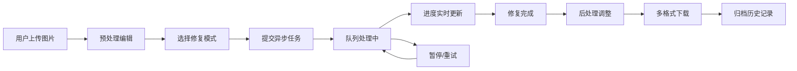

## 1. 产品概述

老照片智能修复工具是一款基于AI算法的Web端图像修复应用，致力于帮助用户恢复和美化老旧破损照片、模糊底片。通过AI技术实现划痕去除、破损补全、人像高清放大、黑白照片智能上色等功能，保留原始光影风格，让珍贵回忆重现光彩。

- 核心价值：将AI图像处理技术民主化，让普通用户无需专业技能即可修复老照片
- 目标用户：摄影爱好者、家庭用户、档案工作者、设计师等有老照片修复需求的人群
- 市场定位：一站式老照片修复解决方案，覆盖从预处理到后处理的全流程

## 2. 核心功能

### 2.1 功能模块

1. **工作台页面**：图片批量上传、预处理编辑、AI修复处理、进度监控
2. **历史记录页面**：历史任务管理、分类筛选、文件下载
3. **图片预览页面**：修复前后对比、后处理调整、多格式导出

### 2.2 页面详情

| 页面名称 | 模块名称 | 功能描述 |
|-----------|-------------|---------------------|
| 工作台 | 批量上传区 | 支持拖拽/点击批量上传老旧破损照片、模糊底片，支持JPG/PNG/TIFF等格式 |
| 工作台 | 预处理工具栏 | 提供图片旋转、自由裁剪、污点手动修补等预处理功能 |
| 工作台 | AI修复选项 | 选择修复模式：划痕去除、破损补全、人像高清放大、黑白上色 |
| 工作台 | 任务队列 | 显示批量任务列表，实时更新处理进度，支持暂停/重试操作 |
| 工作台 | 修复预览 | 左右对比展示修复前后效果，支持放大查看细节 |
| 历史记录 | 分类管理 | 按日期、状态、修复类型分类筛选历史任务 |
| 历史记录 | 批量操作 | 支持批量下载、删除、重新处理历史文件 |
| 图片预览 | 后处理调整 | 亮度、对比度、锐度滑块调节，实时预览效果 |
| 图片预览 | 多格式下载 | 支持JPG/PNG/WebP/TIFF多种格式导出 |

## 3. 核心流程

### 3.1 用户主流程

用户进入工作台，批量上传待修复照片 → 对每张图片进行旋转、裁剪、污点修补等预处理 → 选择AI修复模式并提交任务 → 系统将任务加入异步队列进行处理 → 用户实时查看各任务处理进度，可暂停或重试 → 修复完成后进入预览页进行亮度/对比度/锐度调整 → 选择格式下载修复后的图片 → 所有任务自动归档到历史记录

### 3.2 流程图

## 4. 用户界面设计

### 4.1 设计风格

**美学方向：复古胶片工作室风格**
- 整体调性：温暖怀旧与现代科技感的融合，暗色调为主，营造专业暗房氛围
- 主色调：深褐色 `#2D1B0E` 作为主背景，搭配复古金色 `#C9A962` 作为强调色
- 辅助色：暗铜绿 `#3D5A54` 用于功能按钮，暖米白 `#F5EDE0` 用于文字
- 字体：标题使用 "Playfair Display" 衬线字体，正文使用 "Inter" 无衬线字体
- 按钮风格：微立体圆角按钮，hover时有微妙的光泽变化和阴影加深
- 布局风格：卡片式布局，轻微的胶片颗粒纹理背景，精细的分隔线和边框
- 图标风格：线性图标，统一的2px描边，圆角风格

### 4.2 页面设计概述

| 页面名称 | 模块名称 | UI Elements |
|-----------|-------------|-------------|
| 工作台 | 顶部导航 | 深色背景，金色logo，渐变文字导航项，右侧用户信息 |
| 工作台 | 上传区域 | 虚线边框拖放区，复古相机图标，悬停时边框变金色 |
| 工作台 | 图片缩略图栏 | 横向滚动胶片条样式，选中项有金色边框高亮 |
| 工作台 | 编辑画布 | 深灰色背景，图片居中显示，编辑工具浮层 |
| 工作台 | 任务队列 | 卡片式列表，进度条用金色渐变，状态标签用不同颜色区分 |
| 历史记录 | 筛选栏 | 标签式筛选器，下拉日期选择器，搜索框 |
| 历史记录 | 网格视图 | 响应式网格，悬停显示操作按钮 |
| 图片预览 | 对比视图 | 左右滑动对比器，分界线有金色手柄 |
| 图片预览 | 调整面板 | 垂直滑块组，数值实时显示，重置按钮 |

### 4.3 响应式设计

- **桌面端（1200px+）**：三栏布局 - 左侧图片列表、中间编辑画布、右侧属性面板
- **平板端（768px-1199px）**：两栏布局 - 底部图片列表、上方编辑区，面板可折叠
- **移动端（<768px）**：单栏流式布局，底部标签栏切换视图，触控优化操作按钮

### 4.4 交互与动效

- 页面加载：渐入动画，元素按层级顺序出现，营造胶片显影的视觉效果
- 图片上传：缩略图从底部滑入，伴随轻微的缩放弹性动效
- 进度更新：进度条使用平滑过渡动画，完成时有金色闪光效果
- 按钮交互：hover时轻微上浮（translateY(-2px)），shadow加深，点击时缩放反馈
- 面板切换：滑入滑出动效，配合淡入淡出
- 修复完成：图片从灰度渐变为彩色，模拟照片显影过程
